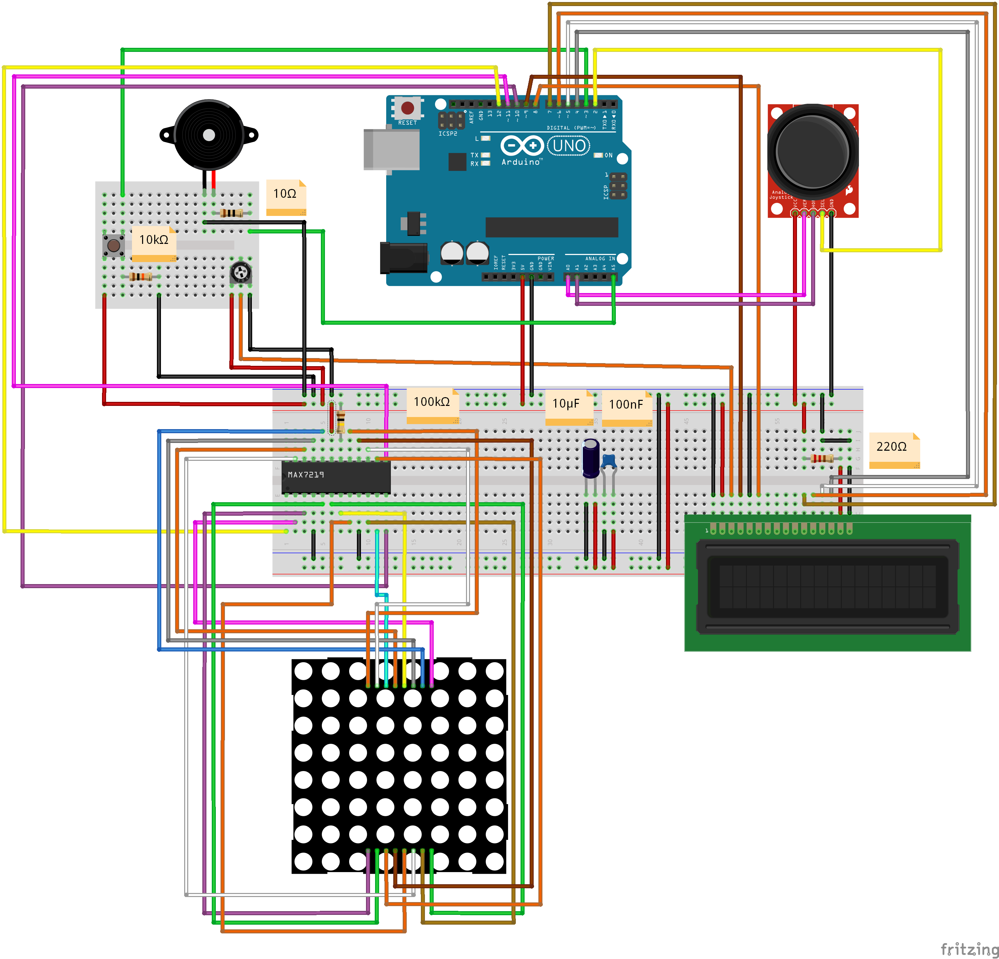
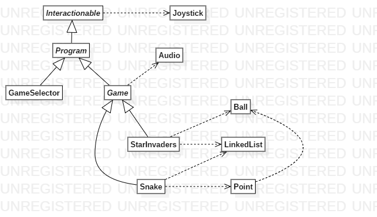

## Project main diagrams
### Circuit schema

### Class structure diagrams: 

## How to play
The system boots in a game selector program. Move joystick up/down to select and press joystick button to select  
When you selected a game and you are ready to play press joystick button  
You have a special button for pause/back to menu (first it puts the game on pause, at the second click quits the game)  
Explore each game and have fun! 😋  